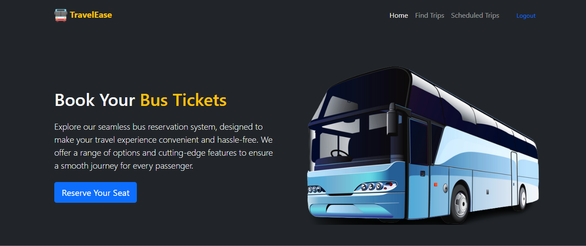
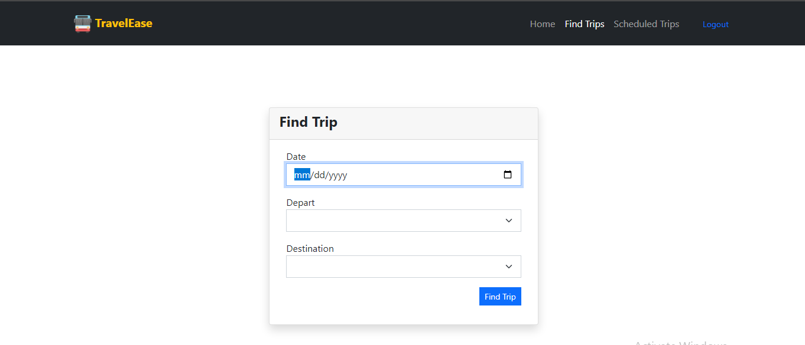
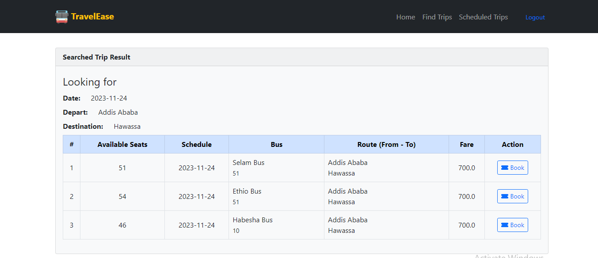
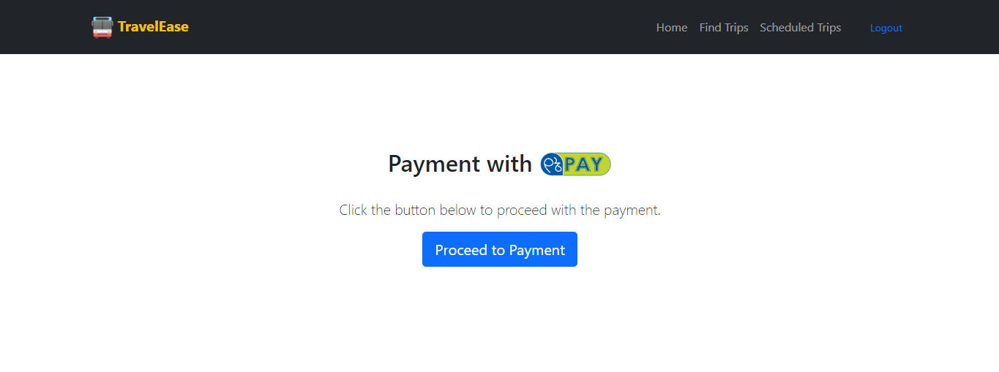

# TravelEase Bus Reservation System

## **TravelEase**

Welcome to TravelEase, a bus reservation system built as a personal learning project. TravelEase allows users to search for bus schedules, book available seats, and securely complete the payment process using the local payment gateway, YenePay. This project is developed using HTML, CSS, Bootstrap, JavaScript, and Django.

## **Features**

### Search Schedules: 

Users can easily search for available bus schedules based on their preferred routes and travel dates.

### Seat Selection: 

TravelEase provides an intuitive interface for users to select their preferred seat numbers from the available options.

### Secure Payment: 

The system integrates with the local payment gateway, YenePay, ensuring a secure and reliable payment process for users.

## **Setup**

To set up the TravelEase Bus Reservation System locally, follow these steps:

1. Clone the repository: `git clone https://github.com/Nathaniel81/Bus-Reservation-Sytem.git`
2. Install the necessary dependencies: `pip install -r requirements.txt`
3. Set up the database: `python manage.py migrate`
4. Start the development server: `python manage.py runserver`

Make sure you have Python and Django installed on your machine before proceeding with the above steps.
The application will be accessible at http://localhost:8000/ in your web browser.

## **Learning Journey**

Building a full-stack web application using HTML, Bootstrap, JavaScript, and Django.
Integrating a payment gateway (YenePay) for secure and seamless transactions.
Designing and implementing features such as schedule search, seat selection, and payment processing.

## **App Preview** :

<table width="100%"> 
<tr>
<td width="50%">      
&nbsp; 
 

  Landing

</td> 
<td width="50%">
 

  Search

  
</td>
<td width="50%">
 

  Result

</td>
<td width="50%">
 

  Payment

  
</td>
</table>
